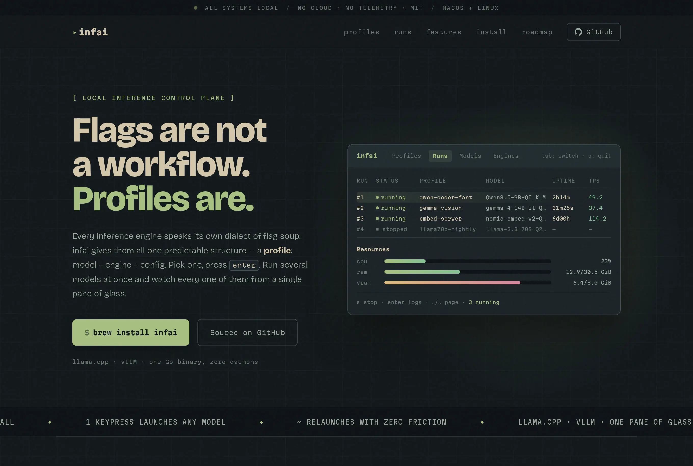

# infai

```
██╗███╗   ██╗███████╗ █████╗ ██╗
██║████╗  ██║██╔════╝██╔══██╗██║
██║██╔██╗ ██║█████╗  ███████║██║
██║██║╚██╗██║██╔══╝  ██╔══██║██║
██║██║ ╚████║██║     ██║  ██║██║
╚═╝╚═╝  ╚═══╝╚═╝     ╚═╝  ╚═╝╚═╝
```



**A terminal UI for managing and launching local inference servers.**

Configure launch profiles for [llama.cpp](https://github.com/ggerganov/llama.cpp) and [vLLM](https://github.com/vllm-project/vllm), scan model directories for GGUF and SafeTensors files, download models from HuggingFace, and monitor running servers — all from a single TUI.

---

## Installation

### Homebrew (macOS / Linux)

```bash
brew install dipankardas011/tap/infai
```

### Script (Linux)

```bash
curl -sL https://raw.githubusercontent.com/dipankardas011/infai/main/install.sh | bash
```

### Binary

Download a pre-built binary from the [Releases](https://github.com/dipankardas011/infai/releases) page.

Builds are available for Linux (amd64, arm64) and macOS (amd64, arm64).

### From source

Requires Go 1.23+ and a C compiler (CGO is needed for SQLite).

```bash
go install github.com/dipankardas011/infai@latest
```

## Usage

```bash
infai            # launch the TUI
infai --version  # print version
```

On first launch, infai creates a local SQLite database to store scan directories, engine paths, and launch profiles. Add at least one model directory and one inference engine to get started.

## Features

- **Multi-engine support** — llama.cpp and vLLM. Configure binary paths, add arguments, and manage multiple engine installations.
- **Model scanning** — Recursively scans configured directories for GGUF and SafeTensors model files. Detects multimodal projectors and links them automatically.
- **HuggingFace downloads** — Search and download models directly from HuggingFace Hub. Supports GGUF variant selection for repos with multiple quantizations. Downloads are resumable and atomic.
- **Launch profiles** — Save named configurations (context size, batch size, GPU layers, port, extra flags) per model. Launch, edit, or delete profiles from the TUI.
- **Live server monitoring** — View real-time inference logs in a scrollable viewport. Tracks tokens-per-second and request metrics from the running server's `/metrics` endpoint.
- **Themes** — 11 built-in themes: tokyonight, everforest, onedark, rosepine, gruvbox, catppuccin, nord, dracula, kanagawa, solarized, monokai.

## Key bindings

| Screen | Keys | Action |
|---|---|---|
| Home | `a` `f` `c` | All models / Manage folders / Configure engines |
| Model list | `Enter` `/` `r` | Select / Filter / Rescan |
| Profile list | `Enter` `e` `d` | Launch / Edit / Delete |
| Editor | `Tab` `Space` `Ctrl+S` | Navigate / Toggle / Save |
| Logs | `s` `Esc` `Up/Down` | Stop server / Back / Scroll |

## Data storage

All settings and profiles are stored in a local SQLite database:

| OS | Path |
|---|---|
| Linux | `~/.config/infai/config.db` |
| macOS | `~/Library/Application Support/infai/config.db` |
| Windows | `%AppData%\infai\config.db` |

Schema migrations run automatically on startup.

## Contributing

Bug reports and pull requests are welcome on [GitHub](https://github.com/dipankardas011/infai).

```bash
# clone and build
git clone https://github.com/dipankardas011/infai.git
cd infai
go build -o infai ./cmd/inference

# run tests
go test ./...
```

## License

[Apache 2.0](LICENSE)
